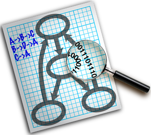

Lucky Cat
=========

Cats make their own luck

#### Links
The project's home page:  https://github.com/marknelsonengineer-sp23/sre_lab4_memscan  (hosted by GitHub)

The source code is documented at:  https://www2.hawaii.edu/~marknels/sre/memscan  (hosted by The University of Hawaii at Mnoa)

# Lucky Cat
Lorem ipsum

# Makefile {#MakeTargets}
This simulation uses the following `Makefile` targets:

| Command        | Purpose                                                   |
|----------------|-----------------------------------------------------------|
| `make`         | Compile (with clang++)                                    |
| `make test`    | Compile and run it                                        |
| `make debug`   | Compile with debug mode ( `DEBUG` is defined)             |
| `make clean`   | Remove all compiler-generated files                       |
| `make doc`     | Make a Doxygen website                                    |
| `make lint`    | Use `clang-tidy` to do static analysis on the source code |
| `make valgrind`| Use `valgrind` to do dynamic analysis on the source code  |

# Toolchain
This project is the product of a tremendous amount of R&D and would not be
possible without the following world-class tools:

| Tool           | Website                    |                                                          Logo                                                          |
|----------------|----------------------------|:----------------------------------------------------------------------------------------------------------------------:|
| **gcc**        | https://gcc.gnu.org        |                |
| **llvm/clang** | https://clang.llvm.org     |             |
| **Boost**      | https://boost.org          |            |
| **Doxygen**    | https://doxygen.nl         |        |
| **DOT**        | https://graphviz.org       |                |
| **Git**        | https://git-scm.com        |                |
| **GitHub**     | https://github.com         |          |
| **Linux**      | https://kernel.org         |            |
| **ArchLinux**  | https://archlinux.org      |    |
| **VirtualBox** | https://www.virtualbox.org |  |
| **Valgrind**   | https://valgrind.org       |      |
